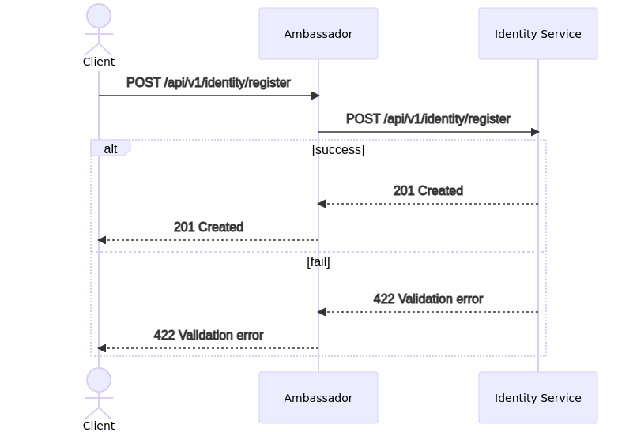
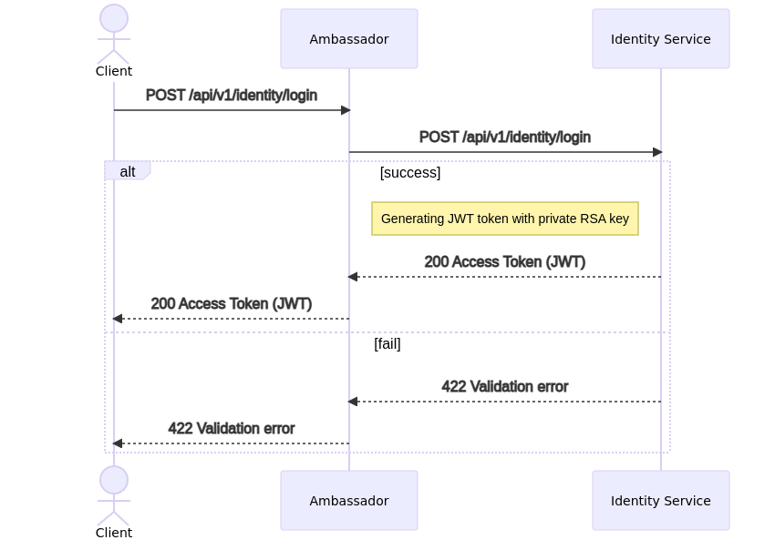
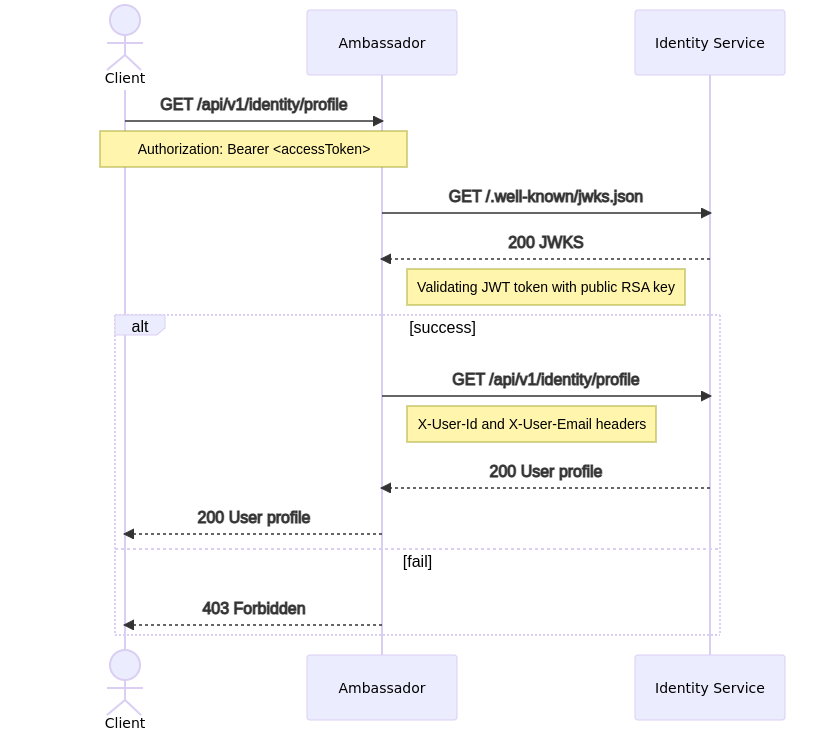
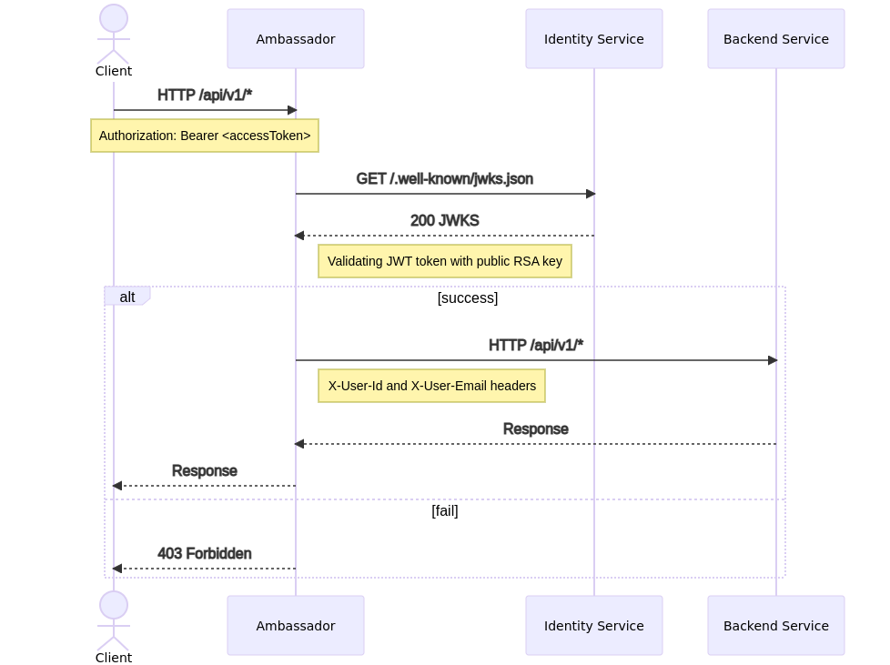

# Otus Microservice architecture Homework 5

## Домашнее задание выполнено для курса ["Microservice architecture"](https://otus.ru/lessons/microservice-architecture/)

### Запуск приложения

```shell
kubectl create namespace otus

# установка ambassador
helm install aes datawire/ambassador -f deploy/ambassador-values.yaml
# применение настроек ambassador
kubectl apply -f services/ambassador/

## запуск проекта
helm install --wait -f deployments/identity-values.yaml identity-service ./deployments/identity-service --atomic
helm install --wait echo-service ./deployments/echo-service --atomic
```

### Тестирование

Тесты Postman расположены в директории `test/postman`. Запуск тестов.

```bash
newman run ./test/postman/test.postman_collection.json
```

Или с использованием Docker.

```bash
docker run -v $PWD/test/postman/:/etc/newman --network host -t postman/newman:alpine run test.postman_collection.json
```

## Диаграммы взаимодействия сервисов

### Регистрация



### Аутентификация



### Доступ к профилю



### Запрос в backend сервис


