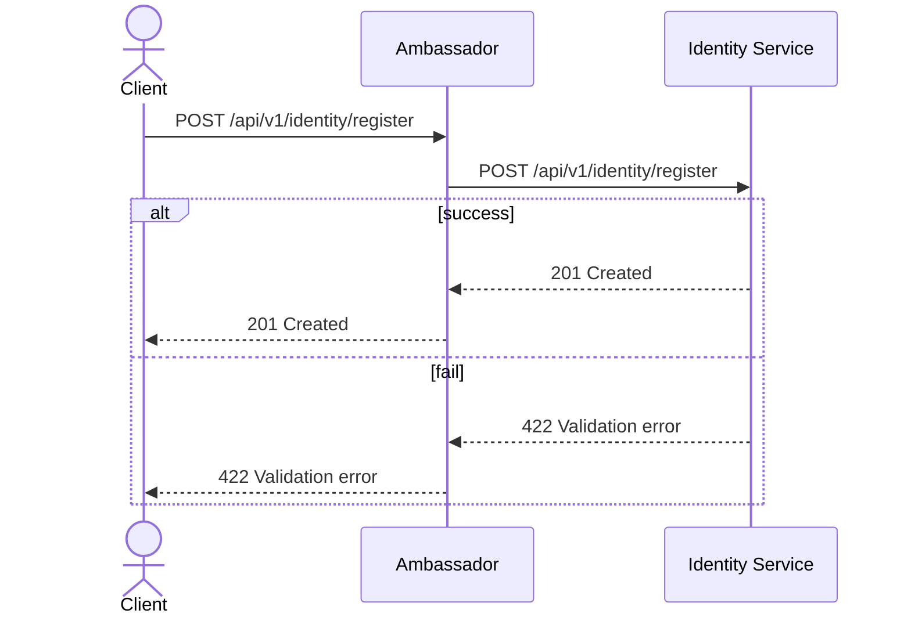
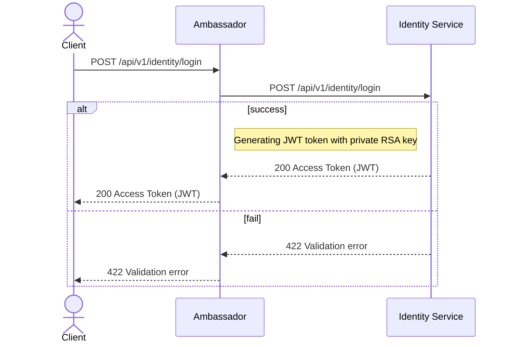
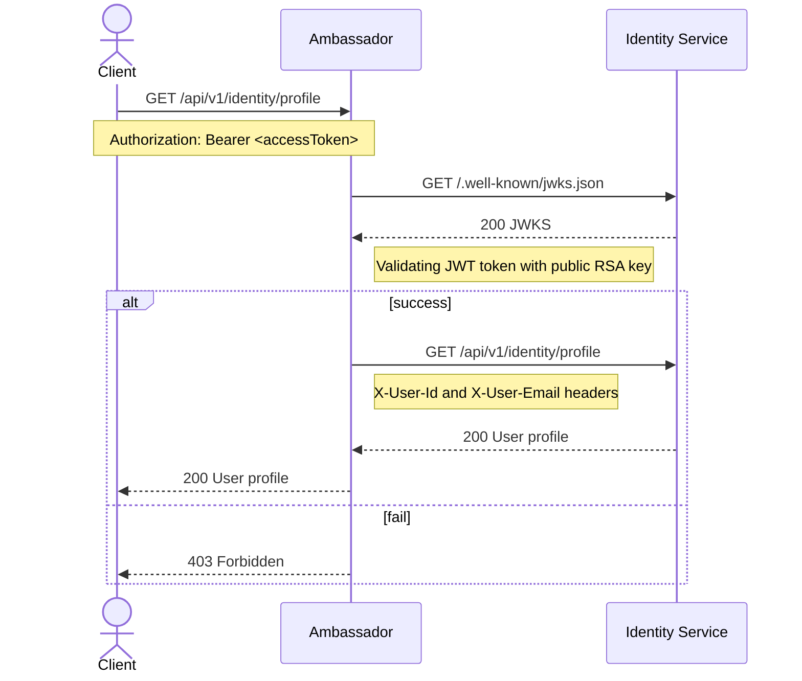
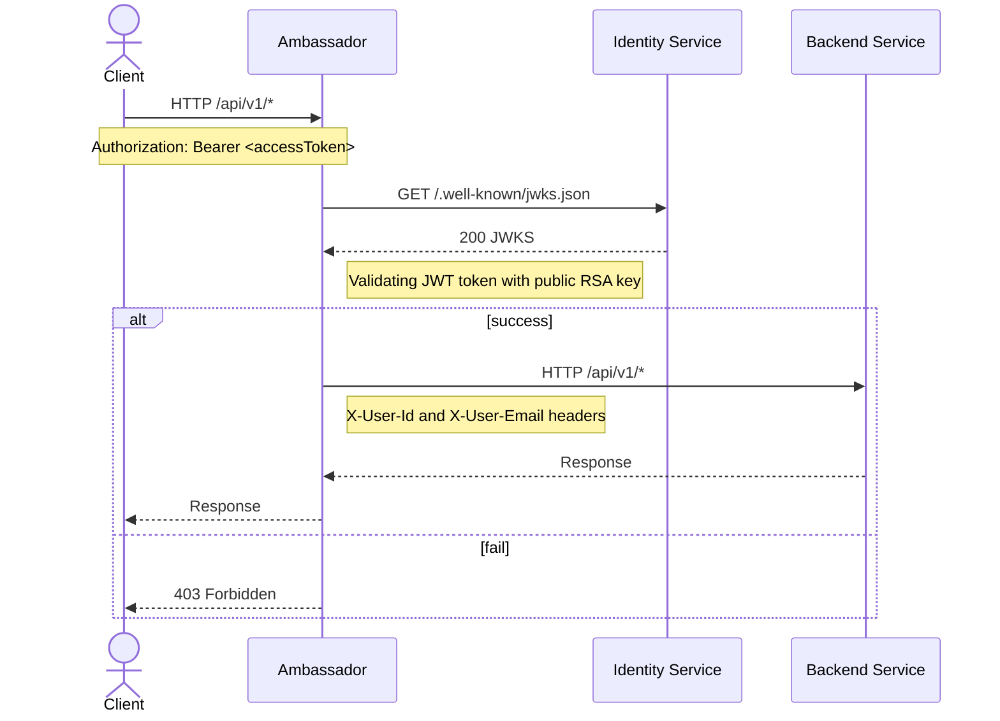

# Диаграммы взаимодействия сервисов

## Регистрация

```mermaid
sequenceDiagram
    actor Client
    Client->>Ambassador: POST /api/v1/identity/register
    Ambassador->>Identity Service: POST /api/v1/identity/register
    alt success
        Identity Service-->>Ambassador: 201 Created
        Ambassador-->>Client:  201 Created
    else fail
        Identity Service-->>Ambassador: 422 Validation error
        Ambassador-->>Client:  422 Validation error
    end
```

## Аутентификация

```mermaid
sequenceDiagram
    actor Client
    Client->>Ambassador: POST /api/v1/identity/login
    Ambassador->>Identity Service: POST /api/v1/identity/login
    alt success
        Note right of Ambassador: Generating JWT token with private RSA key
        Identity Service-->>Ambassador: 200 Access Token (JWT)
        Ambassador-->>Client:  200 Access Token (JWT)
    else fail
        Identity Service-->>Ambassador: 422 Validation error
        Ambassador-->>Client:  422 Validation error
    end
```

## Доступ к профилю

```mermaid
sequenceDiagram
    actor Client
    Client->>Ambassador: GET /api/v1/identity/profile
    Note over Client,Ambassador: Authorization: Bearer <accessToken>
    Ambassador->>Identity Service: GET /.well-known/jwks.json
    Identity Service-->>Ambassador: 200 JWKS
    Note right of Ambassador: Validating JWT token with public RSA key
    alt success
        Ambassador->>Identity Service: GET /api/v1/identity/profile
        Note right of Ambassador: X-User-Id and X-User-Email headers
        Identity Service-->>Ambassador: 200 User profile
        Ambassador-->>Client: 200 User profile
    else fail
        Ambassador-->>Client: 403 Forbidden
    end
```

## Запрос в backend сервис

```mermaid
sequenceDiagram
    actor Client
    Client->>Ambassador: HTTP /api/v1/*
    Note over Client,Ambassador: Authorization: Bearer <accessToken>
    Ambassador->>Identity Service: GET /.well-known/jwks.json
    Identity Service-->>Ambassador: 200 JWKS
    Note right of Ambassador: Validating JWT token with public RSA key
    alt success
        Ambassador->>Backend Service: HTTP /api/v1/*
        Note right of Ambassador: X-User-Id and X-User-Email headers
        Backend Service-->>Ambassador: Response
        Ambassador-->>Client: Response
    else fail
        Ambassador-->>Client: 403 Forbidden
    end
```
